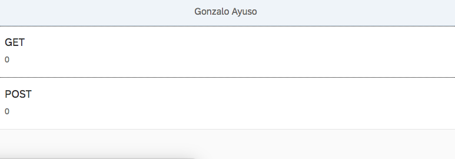
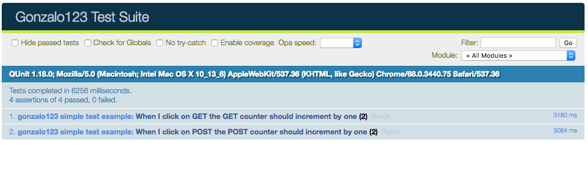

## Working locally with SAPUI5 (with PHP/Lumen Backend) and deploying to SCP

When I work in SAPUI5 projects I normally use WebIDE. WebIDE is a great tool but I'm more confortable working locally, with my IDE. 
I've this idea in my mind but I never find the time slot to do it. Finally, after finding this project in github (https://github.com/hschaefer123/cachebuster) I realized how easy it's and I started to work with this project and adapt it to my needs

The base of this project is localneo. Localneo start a http serve based on neo-app.json file. That means We're going to use the same configuration than we'll in production at SCP. Of course we'll need destinations. We only need one extra file called destination.json where we'll set up our destinations (one http proxy, nothing else).

## The backend

For example I'll use in this example one PHP/Lumen application

```php
$app->router->group(['prefix' => '/api', 'middleware' => Middleware\AuthMiddleware::NAME], function (Router $route) {
    $route->get('/', Handlers\HomeHandler::class);
    $route->post('/', Handlers\HomeHandler::class);
});
```

Basically it has two routes. In fact both routes are the same. One accept POST request and another one GET requests. 
They'll answer with the current date in a json file

```php
namespace App\Http\Handlers;

class HomeHandler
{
    public function __invoke()
    {
        return ['date' => (new \DateTime())->format('c')];
    }
}
```

Both routes are under one middelware to provide the authentication.

```php
namespace App\Http\Middleware;

use Closure;
use Illuminate\Http\Request;

class AuthMiddleware
{
    public const NAME = 'auth';

    public function handle(Request $request, Closure $next)
    {
        $user = $request->getUser();
        $pass = $request->getPassword();

        if (!$this->validateDestinationCredentials($user, $pass)) {
            $headers = ['WWW-Authenticate' => 'Basic'];

            return response('Backend Login', 401, $headers);
        }

        $authorizationHeader = $request->header('Authorization2');
        if (!$this->validateApplicationToken($authorizationHeader)) {
            return response('Invalid token ', 403);
        }

        return $next($request);

    }

    private function validateApplicationToken($authorizationHeader)
    {
        $token = str_replace('Bearer ', null, $authorizationHeader);

        return $token === getenv('APP_TOKEN');
    }

    private function validateDestinationCredentials($user, $pass)
    {
        if (!($user === getenv('DESTINATION_USER') && $pass === getenv('DESTINATION_PASS'))) {
            return false;
        }

        return true;
    }
}
```

That means our service will need a Basic Authentication and also one Token based authentication.

## The frontend

Our ui5 application will use one destination called BACKEND. We'll configure it within our neo-app.json file
```json
    ...
    {
      "path": "/backend",
      "target": {
        "type": "destination",
        "name": "BACKEND"
      },
      "description": "BACKEND"
    }
    ...
```

Now we'll create our extra file called destinations.json
localneo will use this file to create a http server to serve our frontend locally using the destination.

As I said before our backend will need a Basic Authentication. This Authentication will be set up in the destination configuration

```json
{
  "server": {
    "port": "8080",
    "path": "/webapp/index.html",
    "open": true
  },
  "service": {
    "sapui5": {
      "useSAPUI5": true,
      "version": "1.54.8"
    }
  },
  "destinations": {
    "BACKEND": {
      "url": "http://localhost:8888",
      "auth": "superSecretUser:superSecretPassword"
    }
  }
}
```

Our application will be a simple List of

```xml
<mvc:View controllerName="gonzalo123.controller.App"
          xmlns:html="http://www.w3.org/1999/xhtml"
          xmlns:mvc="sap.ui.core.mvc"
          displayBlock="true"
          xmlns="sap.m">
  <App id="idAppControl">
    <pages>
      <Page title="{i18n>appTitle}">
        <content>
          <List>
            <items>
              <ObjectListItem id="GET"
                              title="{i18n>get}"
                              type="Active"
                              press="getPressHandle">
                <attributes>
                  <ObjectAttribute id="getCount"
                                   text="{/Data/get/count}"/>
                </attributes>
              </ObjectListItem>
              <ObjectListItem id="POST"
                              title="{i18n>post}"
                              type="Active"
                              press="postPressHandle">
                <attributes>
                  <ObjectAttribute id="postCount"
                                   text="{/Data/post/count}"/>
                </attributes>
              </ObjectListItem>
            </items>
          </List>
        </content>
      </Page>
    </pages>
  </App>
</mvc:View>
```



When we click on GET we'll perform a GET request to the backend and we'll increment the counter. The same with POST

```js
sap.ui.define([
  "sap/ui/core/mvc/Controller",
  "sap/ui/model/json/JSONModel",
  'sap/m/MessageToast',
  "gonzalo123/model/api"
], function (Controller, JSONModel, MessageToast, api) {
  "use strict";

  return Controller.extend("gonzalo123.controller.App", {
    model: new JSONModel({
      Data: {get: {count: 0}, post: {count: 0}}
    }),

    onInit: function () {
      this.getView().setModel(this.model);
    },

    getPressHandle: function () {
      api.get("/", {}).then(function (data) {
        var count = this.model.getProperty('/Data/get/count');
        MessageToast.show("Pressed : " + data.date);
        this.model.setProperty('/Data/get/count', ++count);
      }.bind(this));
    },

    postPressHandle: function () {
      var count = this.model.getProperty('/Data/post/count');
      api.post("/", {}).then(function (data) {
        MessageToast.show("Pressed : " + data.date);
        this.model.setProperty('/Data/post/count', ++count);
      }.bind(this));
    }
  });
});

```

## Start our application locally
Now we only need to start the backend
> php -S 0.0.0.0:8888 -t www

And the frontend
> localneo

## Debugging locally

As we're working locally we can use local debugger in the backend and we can use breakpoints, inspect variables ...

We also can debug the frontend using chrome developer tools. We also can map our local filesystem in the browser and we can save files directly with chrome.

## Testing

We can test the backend using phpunit and run our tests with
> composer run test 

Here we can see a simple test of the backend

```php
public function testAuthorizedRequest()
    {
        $headers = [
            'Authorization2' => 'Bearer superSecretToken',
            'Content-Type'   => 'application/json',
            'Authorization'  => 'Basic ' . base64_encode('superSecretUser:superSecretPassword'),
        ];

        $this->json('GET', '/api', [], $headers)
            ->assertResponseStatus(200);
        $this->json('POST', '/api', [], $headers)
            ->assertResponseStatus(200);
    }


    public function testRequests()
    {

        $headers = [
            'Authorization2' => 'Bearer superSecretToken',
            'Content-Type'   => 'application/json',
            'Authorization'  => 'Basic ' . base64_encode('superSecretUser:superSecretPassword'),
        ];

        $this->json('GET', '/api', [], $headers)
            ->seeJsonStructure(['date']);
        $this->json('POST', '/api', [], $headers)
            ->seeJsonStructure(['date']);
    }
```

We also can test the frontend using OPA5. 


As Backend is already tested we'll mock the backend here using sinon server

```js
...
    opaTest("When I click on GET the GET counter should increment by one", function (Given, When, Then) {
      Given.iStartMyApp("./integration/Test1/index.html");
      When.iClickOnGET();
      Then.getCounterShouldBeIncrementedByOne().and.iTeardownMyAppFrame();
    });

    opaTest("When I click on POST the POST counter should increment by one", function (Given, When, Then) {
      Given.iStartMyApp("./integration/Test1/index.html");
      When.iClickOnPOST();
      Then.postCounterShouldBeIncrementedByOne().and.iTeardownMyAppFrame();
    });
...
```

The configuration of our sinon server:
```js
sap.ui.define(
  ["test/server"],
  function (server) {
    "use strict";

    return {
      init: function () {
        var oServer = server.initServer("/backend/api");

        oServer.respondWith("GET", /backend\/api/, [200, {
          "Content-Type": "application/json"
        }, JSON.stringify({
          "date": "2018-07-29T18:44:57+02:00"
        })]);

        oServer.respondWith("POST", /backend\/api/, [200, {
          "Content-Type": "application/json"
        }, JSON.stringify({
          "date": "2018-07-29T18:44:57+02:00"
        })]);
      }
    };
  }
);

```

## The build process
Before uploading the application to SCP we need to build it. The build process optimizes the files and creates the sap-ui-cachebuster-info.json file (to ensure our users aren't using a cached version of our application)
We'll use grunt to build our application. Here we can see our Gruntfile.js

```js
module.exports = function(grunt) {
    "use strict";

    require('load-grunt-tasks')(grunt);
    require('time-grunt')(grunt);

    grunt.config.merge({
        pkg: grunt.file.readJSON('package.json'),
        jshint: {
            all: ['Gruntfile.js', 'webapp/**/*.js'],
            options: {
                globals: grunt.file.readJSON('.jshintrc')
            }
        },
        watch: {
            js: {
                files: ['Gruntfile.js', 'webapp/**/*.js', 'webapp/**/*.properties'],
                tasks: ['jshint'],
                options: {
                    livereload: true
                }
            },

            livereload: {
                options: {
                    livereload: true
                },
                files: [
                    'webapp/**/*.html',
                    'webapp/**/*.js',
                    'webapp/**/*.css'
                ]
            }
        },
    });

    grunt.registerTask("default", [
        "clean",
        "jshint",
        "build"
    ]);
};
```

In our Gruntfile I've also configure a watcher to build the application automatically and triggering the live reload (to reload my browser every time I change the frontend) 

Now I can build the dist folder with the command:

> grunt

## Deploy to SCP

The deploy process is very well explained in the repository: https://github.com/hschaefer123/cachebuster
Basically we need to download MTA Archive builder and extract it to ./ci/tools/mta.jar. 
Also we need SAP Cloud Platform Neo Environment SDK (./ci/tools/neo-java-web-sdk/)
We can download those binaries from here: https://tools.hana.ondemand.com/#cloud

Then we need to fullfill our scp credentials in ./ci/deploy-mta.properties and configure our application in ./ci/mta.yaml
Finally we will run ./ci/deploy-mta.sh (here we can set up our scp password in order to input it within each deploy)


